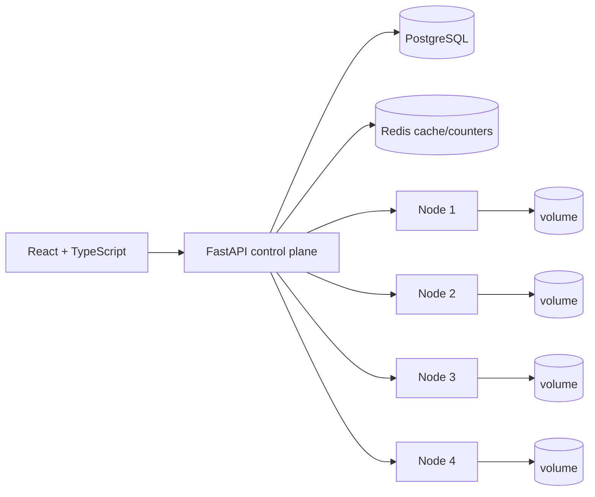

# QuorumVault

**Self-Healing Distributed Backup & Recovery Platform**

QuorumVault is a local distributed backup system built to make the mechanics of reliable storage inspectable: files are chunked, content-addressed with SHA-256, deduplicated, deterministically placed, replicated across independent storage-node volumes, checksum-verified on reads, monitored for node failure, and repaired when redundancy drops.

It is intentionally not a generic cloud-drive clone. The UI is a control surface for the distributed storage engine and its metadata.

## Architecture



The default cluster has four storage nodes and a replication factor of three. Storage nodes are lightweight FastAPI services backed by separate Docker volumes; PostgreSQL stores metadata, while Redis provides short-lived cache data and operational counters.

## What is implemented

- **4 MiB chunking** with ordered reconstruction and bounded per-chunk memory use.
- **SHA-256 content addressing** for every physical chunk.
- **Chunk-level deduplication** across repeated uploads and unchanged regions of later versions.
- **Consistent hashing implemented in-repository**, using virtual nodes and deterministic replica selection.
- **Replication factor 3** across distinct healthy nodes where possible, with fallback placement when a selected node fails during a write.
- **Checksum verification** after write, on storage-node reads, during downloads, integrity scans and repairs.
- **User-facing resumable uploads**: the browser persists only safe session metadata, detects the same reselected file after refresh/interruption, queries received/missing indexes, and offers Resume or Restart without storing file bytes in localStorage.
- **Immutable numbered versions** for each logical filename, including direct restore of any historical version as a newly appended version.
- **Immutable snapshots** that pin exact version IDs.
- **Point-in-time restore** by appending new versions rather than deleting history.
- **Heartbeat/failure detection** with a configurable timeout and explicit replica availability states.
- **Integrity scrubber** that distinguishes corrupted and unavailable replicas.
- **Self-healing repair jobs** with duplicate-work suppression, verified source/destination copies and measured repair duration.
- **Reference-safe garbage collection** that will not delete a chunk referenced by a retained file version, snapshot-pinned version, or active upload session.
- **JWT authentication**, USER/ADMIN roles, file ownership, per-user activity isolation, admin-only maintenance/audit operations, salted PBKDF2 password hashes, validation and upload limits.
- **Internal storage-node authentication** using a shared service token for chunk/check/delete/corruption APIs; health remains unauthenticated. Demo-mode fault injection does not mount the Docker socket.
- **JSON request logs**, correlation IDs, audit events, health endpoints and Redis-backed counters.
- **Concurrency-safe metadata creation** using PostgreSQL upserts plus transaction-scoped advisory/row locking for content identity and version allocation.
- **Docker integration scripts** for real node-failure/repair and corruption/fallback/repair verification.
- **Benchmark harness** that measures sequential and concurrent upload/download behavior and emits JSON rather than hard-coded claims.

## Technology

| Layer | Technology |
|---|---|
| Control plane | Python 3.12+, FastAPI, Pydantic, SQLAlchemy 2.x, Alembic |
| Metadata | PostgreSQL 16 |
| Cache/counters | Redis 7 |
| Storage nodes | Python + FastAPI + filesystem volumes |
| Frontend | React, TypeScript, Vite |
| Runtime | Docker + Docker Compose |
| Tests | pytest, Vitest |
| CI | GitHub Actions |

## Repository layout

```text
quorumvault/
├── backend/             # control plane, metadata, repair and integrity logic
├── storage-node/        # physical content-addressed chunk service
├── frontend/            # engineering console
├── scripts/benchmark/   # measurement harness
├── docs/                # architecture, schema, API, demo and benchmark docs
├── .github/workflows/   # CI
├── docker-compose.yml
└── .env.example
```

## Windows setup

Requirements:

- Docker Desktop with Docker Compose
- Git (optional, for source control)

From PowerShell:

```powershell
Copy-Item .env.example .env
```

For anything beyond a throwaway local demo, replace both `JWT_SECRET` and `QUORUMVAULT_INTERNAL_TOKEN` in `.env` with long random values. Storage-node host ports are exposed only for local debugging/demo work; mutating/read chunk APIs still require the internal token.

Start the full stack:

```powershell
docker compose up --build
```

Useful URLs:

| Service | URL |
|---|---|
| Frontend | http://localhost:8080 |
| Control-plane API | http://localhost:8000 |
| Swagger/OpenAPI | http://localhost:8000/docs |
| Control-plane health | http://localhost:8000/api/health |
| Node 1 health | http://localhost:9001/internal/health |
| Node 2 health | http://localhost:9002/internal/health |
| Node 3 health | http://localhost:9003/internal/health |
| Node 4 health | http://localhost:9004/internal/health |

With the default `.env.example`, demo admin credentials are:

```text
admin@quorumvault.local
QuorumVaultDemo!23
```

A normal USER account can also be created from the registration screen.

## Core upload protocol

The browser splits a file into chunks and calculates SHA-256 for each chunk before transfer.

```text
create upload session
        ↓
submit ordered chunk manifest
        ↓
server returns missing indexes
        ↓
upload only missing chunk bytes
        ↓
replicate + checksum verify
        ↓
reconnect/query session if interrupted
        ↓
finalize immutable file version
```

If enough verified replicas of a hash already exist, that chunk is reused without retransferring its bytes.

## Download protocol

```text
logical file + version
        ↓
ordered chunk references
        ↓
choose available replica
        ↓
read + SHA-256 verify
        ↓
fallback to another replica on failure
        ↓
stream reconstructed file
        ↓
verify complete file SHA-256
```

Corrupted bytes are never silently returned.

## Test commands

Backend:

```powershell
cd backend
python -m pip install -r requirements.txt
pytest -q
```

Storage node:

```powershell
cd ..\storage-node
python -m pip install -r requirements.txt
pytest -q
```

Frontend:

```powershell
cd ..\frontend
npm ci
npm test
npm run build
```

CI uses the committed frontend lockfile with `npm ci`, runs frontend tests/build, and runs pytest plus Ruff checks on the Python services. Docker E2E scenarios are intentionally local/manual because nested Docker is not assumed in standard CI.

## Docker integration verification

With the full stack healthy, run these from the repository root:

```powershell
python scripts/integration/e2e_node_failure_repair.py
python scripts/integration/e2e_corruption_repair.py
```

The first script stops one **real** storage-node container, waits for heartbeat timeout, verifies repair onto a different healthy node, and compares downloaded bytes/SHA-256. The second corrupts one real replica through the protected demo path, verifies checksum detection and healthy-replica fallback, repairs redundancy, and compares the final reconstructed bytes/SHA-256. Neither scenario mocks storage-node reads, writes or repair copying.

## Demo

See [`docs/DEMO.md`](docs/DEMO.md) for the full sequence. The strongest flow is:

1. verify four healthy nodes;
2. upload and inspect chunks/replicas;
3. repeat the upload to show chunk reuse;
4. upload a modified version and inspect reused/new hashes;
5. create a snapshot;
6. make one node unavailable;
7. observe degraded replicas and repair to the spare node;
8. download successfully;
9. corrupt one replica;
10. run an integrity scan and repair;
11. restore the snapshot as new versions.

## Benchmarking

Run the included harness against a live stack:

```powershell
python scripts/benchmark/benchmark.py --base-url http://localhost:8000/api --email admin@quorumvault.local --password "QuorumVaultDemo!23" --size-mib 64 --concurrency 4
```

It reports measured upload/download throughput, request latency, concurrent upload and concurrent download aggregate throughput, latest measured repair duration when a successful repair exists, and deduplication-related storage values. See [`docs/BENCHMARKING.md`](docs/BENCHMARKING.md) before publishing results.

## Design trade-offs

- **Control plane is modular, not fragmented into many services.** The main distributed boundary is between metadata/orchestration and physical storage nodes.
- **Chunk-level consistency is checksum-driven.** QuorumVault does not implement a consensus protocol for metadata; PostgreSQL is the single metadata authority.
- **Cross-system writes are not a distributed transaction.** Idempotent content keys and repair reduce risk, but a production system would add a durable write-intent/outbox state machine for crash recovery.
- **Consistent hashing uses equal node weights.** Capacity-weighted placement is a future improvement.
- **Filesystem nodes favor inspectability.** There is no object-store dependency hiding the storage mechanics.

## Current limitations

- The cluster topology is configured as four known nodes; arbitrary online scale-out/rebalancing is not automated.
- Physical GC is conservative and admin-triggered; there is no user-facing version-deletion workflow yet, so normal usage rarely creates collectible retained-version chunks.
- Repair scheduling is interval-based rather than a durable external work queue.
- PostgreSQL is a single metadata database and therefore not itself highly available in this local architecture.
- Browser hashing buffers one chunk at a time; the default 4 MiB chunk size bounds this, but Web Workers are not yet used.
- The frontend is served as a single Nginx instance in Compose; TLS and internet deployment are outside this repository.

## Future improvements

- durable outbox/write-intent state machine;
- capacity-weighted placement and explicit membership changes;
- version-retention policies and scheduled GC;
- Web Worker hashing in the client;
- distributed repair queue with leases;
- optional encryption-at-rest per chunk;
- Prometheus/OpenTelemetry export;
- metadata high availability.

For algorithm details and limitations, read [`docs/ARCHITECTURE.md`](docs/ARCHITECTURE.md). Database relationships are documented in [`docs/DATABASE.md`](docs/DATABASE.md), and endpoint behavior in [`docs/API.md`](docs/API.md).


## Measured failure-testing upgrade

This repository includes a controlled local chaos/measurement layer. It does not claim recovery from failures that leave a requested chunk with no verified healthy replica.

### Explicit data health

QuorumVault derives four states from actual replica health and active repair state:

- **HEALTHY** — configured healthy replica count is satisfied.
- **DEGRADED** — at least one verified copy remains, but redundancy is below target.
- **REPAIRING** — the object is recoverable and a repair is active.
- **UNRECOVERABLE** — at least one required chunk has no verified healthy replica.

Admin metrics are available from `GET /api/metrics`; per-user latest-object health is available from `GET /api/data-health`.

### Controlled chaos harness

With the local Compose cluster healthy:

```powershell
python scripts/chaos/chaos_harness.py --output-dir docs/generated
```

The harness exercises real storage containers for single-node failure, two-node failure, corruption, replica deletion, failure during upload, failure during restore/download, and repair-source failure. It writes `failure-matrix.json` and `failure-matrix.md` from observed results. Every recovery success verifies the reconstructed bytes and SHA-256.

### Benchmark suite

```powershell
python scripts/benchmark/benchmark_suite.py --sizes-mib 1,4,8 --iterations 3 --output docs/generated/benchmark-smoke.json
```

Use larger iteration counts before publishing performance claims. p99 is deliberately omitted unless at least 100 observations exist. Consistent-hash join/remove percentages are algorithm-level membership experiments; automatic live topology expansion remains a limitation.

### Failure and consistency documentation

- [Repository audit](docs/REPOSITORY_AUDIT.md)
- [Failure model](docs/FAILURE_MODEL.md)
- [Consistency model](docs/CONSISTENCY_MODEL.md)
- [Upgrade changelog](docs/UPGRADE_CHANGELOG.md)
- [Résumé metrics template](docs/resume-metrics-template.md)

The metadata database remains a single PostgreSQL authority, cross-system writes are not a distributed transaction, and arbitrary online membership/rebalancing is not automated.
