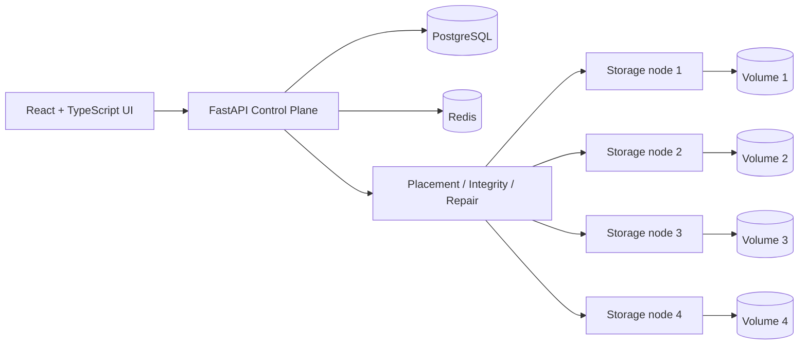

# QuorumVault Architecture

## System shape

The control plane owns metadata, identity, placement decisions, consistency checks, repair orchestration and the public API. Storage nodes are intentionally small filesystem-backed services. Control-plane-to-node chunk operations use a shared internal service token, and the control plane reuses a bounded long-lived `httpx.AsyncClient` connection pool with configured connect/read/write/pool timeouts.

## Chunk pipeline

The default chunk size is 4 MiB. Browser uploads are divided into ordered blobs and SHA-256 is calculated before transfer. The upload-session manifest contains `(index, hash, size)` tuples. The control plane returns indexes whose content is not already represented by the desired number of healthy replicas, so only missing chunk bytes are transferred.

A storage node persists a chunk at `aa/bb/<full-sha256>`. Writes use a temporary file, `fsync`, atomic replace and post-write checksum verification. Reads re-hash the bytes and refuse corrupted content.

## User-facing resumability

The browser stores only safe metadata for active uploads: session ID, filename, size, last-modified value, chunk size, manifest fingerprint and creation time. It never puts the complete file in local storage. After refresh/interruption, the user reselects the file; the browser recomputes its chunk hashes/fingerprint, validates the stored session with the backend, and offers Resume or Restart. Resume re-queries missing indexes and sends only those chunks. Successful finalization removes the persisted session metadata.

## Content addressing, deduplication and concurrency

The SHA-256 hash is the content identity. Identical chunks therefore share one `chunks` row and can reuse existing healthy replicas across files/users/versions. PostgreSQL chunk creation uses `INSERT ... ON CONFLICT DO NOTHING`, and `(chunk_hash,node_id)` replica metadata uses an upsert, so two concurrent uploads of the same content converge on one metadata identity instead of surfacing a uniqueness error.

Logical filenames are unique per owner. Finalization serializes version allocation with a PostgreSQL transaction-scoped advisory key and locks the logical-file row before selecting the next version number; the database uniqueness constraint on `(logical_file_id, version_number)` remains in place. Historical-version and snapshot restores use the same canonical per-file serialization key, so they append history rather than racing an upload finalization.

## Consistent hash ring

`backend/app/services/placement.py` implements the ring directly. Each healthy node contributes 64 virtual points by hashing `node-id#virtual-index` with SHA-256 and using the first 64 bits as the ring coordinate.

Placement hashes the chunk key into the same space, binary-searches the first clockwise virtual point, walks clockwise choosing distinct physical node IDs, and stops at replication factor 3 or available membership. Sorted node IDs make the ring deterministic for a fixed membership set. Virtual nodes reduce obvious imbalance but do not provide capacity weighting.

## Replication and verified reads

Desired replication is three distinct healthy nodes. Each control-plane write is followed by a node-level checksum check. Downloads resolve the exact version and ordered chunk references; each chunk attempts healthy replicas until one returns bytes whose SHA-256 matches the expected key. A corrupted/unavailable replica is skipped. The reconstructed stream is also compared with the complete file SHA-256 recorded at finalization.

## Heartbeats and failure detection

The control plane polls `/internal/health` on every node. Successful heartbeats update last-seen time, physical bytes and chunk count. A failed poll does **not** immediately mark a previously healthy node down: the node becomes `UNHEALTHY` only after `HEARTBEAT_TIMEOUT_SECONDS` has elapsed since its last successful heartbeat. Its healthy replicas are then marked `UNAVAILABLE`. When the node returns, unavailable replicas become `DEGRADED` until checksum verification promotes them again.

## Integrity scrub and self-healing

Integrity scanning asks each healthy node to verify physical content. Valid replicas become `HEALTHY`, mismatches become `CORRUPTED`, and unreachable copies become `UNAVAILABLE`. Repair identifies under-replicated chunks, avoids active duplicate jobs, fetches a verified source, selects a healthy destination not already holding a good copy, writes and verifies the destination, upserts replica metadata, and records measured duration.

## Versioning, snapshots and restore

Versions are immutable. Uploading the same logical name appends the next number. A direct historical restore (`v2` while current is `v5`) creates `v6` with the ordered chunk references and file hash of v2. Snapshots pin exact file-version IDs and snapshot restore similarly appends new versions. No restore operation deletes or rewrites history.

## Authorization boundaries

JWT identity is enforced by the backend. USER accounts see only their owned files/uploads/snapshots and only their own recent activity. ADMIN is required for global audit, integrity scans, repair scans, garbage collection and destructive demo controls. The frontend consumes `/api/me` and removes admin-only navigation for USER accounts, but backend checks remain authoritative.

## Garbage-collection safety

GC rejects any chunk referenced by a retained file version or active upload. Snapshot references remain safe because snapshots pin retained versions, whose ordered chunk rows still reference the content. Physical GC is conservative and admin-triggered.

## Transactional boundary

PostgreSQL is the metadata authority, but metadata writes and storage-node filesystem writes are not one distributed transaction. Content-addressed idempotent writes, checksum verification and repair make partial failures recoverable; a production evolution could add a durable write-intent/outbox state machine for stronger cross-system crash recovery.
