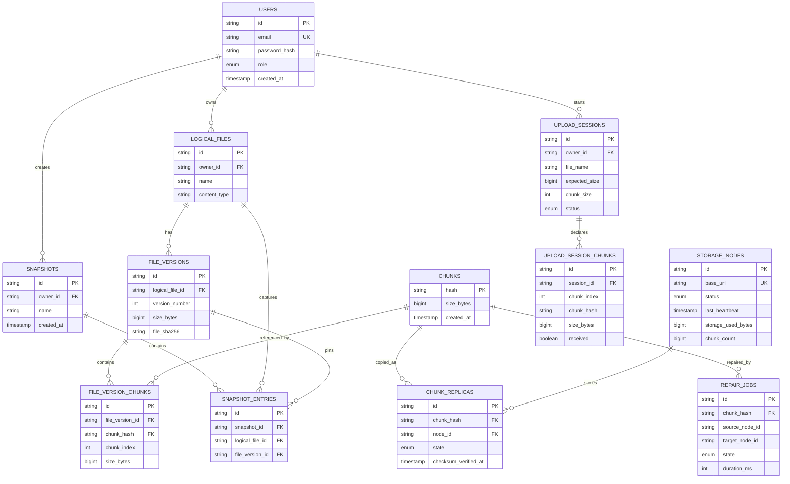

# Database Design

PostgreSQL is the source of truth for logical metadata. Physical chunk bytes live only on storage-node volumes.

## Important constraints

- `users.email` is unique.
- `(owner_id, logical_files.name)` is unique, so another upload of the same logical name becomes another version.
- `(logical_file_id, version_number)` is unique.
- `(file_version_id, chunk_index)` and `(upload_session_id, chunk_index)` are unique.
- `(chunk_hash, node_id)` is unique, preventing duplicate replica metadata for the same physical node.
- Chunk hashes are indexed anywhere they are used for lookup-heavy joins.
- Replica and repair states are indexed for health/repair queries.

## Transaction boundaries

Creating an upload session and its manifest is one metadata transaction. Each accepted chunk commits chunk/replica metadata only after required writes are checksum-verified. Finalization verifies all session chunks, calculates the complete file hash from verified replicas, creates the new immutable version and marks the session finalized in one metadata transaction.

Snapshot creation records a consistent set of exact version IDs within one SQLAlchemy session transaction. Restore appends new versions and does not delete source versions.

## Migration

Alembic owns schema revision `0001`. The initial migration calls SQLAlchemy metadata creation against Alembic's bound connection; later revisions should use explicit incremental `op.*` operations to evolve existing deployments safely.
